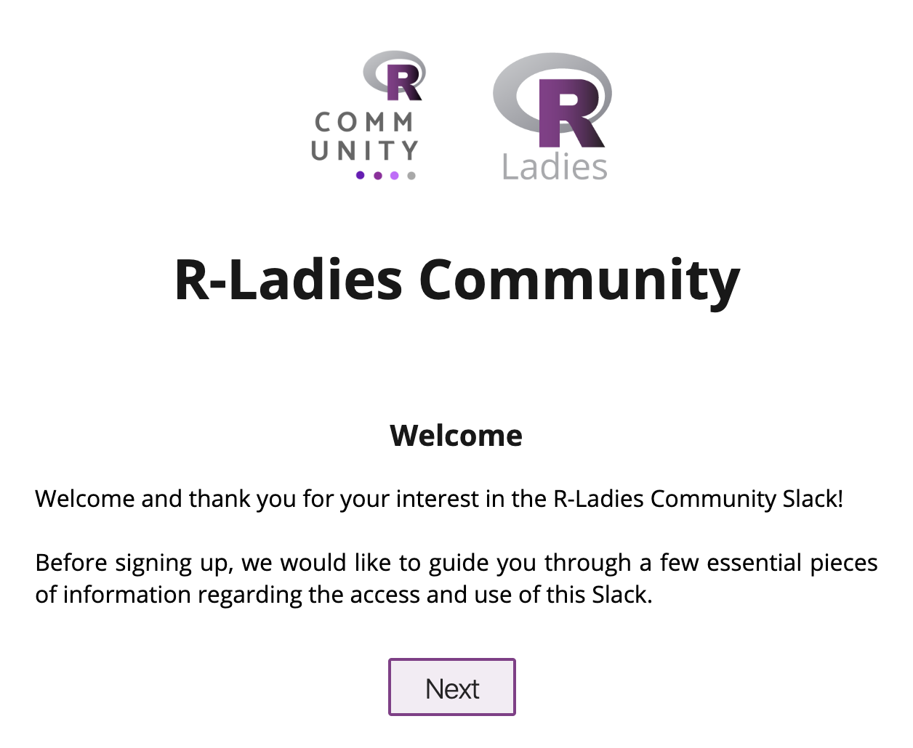

Slack Invite Automation
------------

[](https://travis-ci.com/outsideris/slack-invite-automation)


Custom web app to invite to the R-Ladies Community Slack. This is forked from the [outsideris repository](https://github.com/outsideris/slack-invite-automation), thank you! 💜

[](https://heroku.com/deploy)

## Settings

You can set variables for your own purpose in `config.js` or environment variables.

### `config.js`

Fill out `config.js` as your infomation.

* `community`: your community or team name to display on join page.
* `slackUrl` : your slack team url (ex.: socketio.slack.com)
* `slacktoken` : Your access token for Slack. (see [Issue token](#issue-token))
* `inviteToken`: An optional security measure - if it is set, then that token will be required to get invited.
* `recaptchaSiteKey`: An optional security measure - if it is set, and `recaptchaSecretKey` is set, then a captcha will be required to get invited.
* `recaptchaSecretKey`: An optional security measure - if it is set, and `recaptchaSiteKey` is set, then a captcha will be required to get invited.
* `locale`: Application language (currently `cs`, `de`, `en`, `es`, `fr`, `it`,  `ja`, `ko`, `nl`, `pl`, `pt`, `pt-BR`, `tr`, `zh-CN` and `zh-TW` available).
* `subpath`: Sub-path in URL. For example, if `/example` is set, it's served in `/example`, not `/`. Default is `/`.


### Heroku

Add the application settings that are defined in the environment variables above.

## Run
[Node.js](http://nodejs.org/) is required.

```shell
$ git clone https://github.com/rladies/slack-invite-automation.git
$ cd slack-invite-automation
$ npm install
$ npm start
```

You can access <http://localhost:3000> on your web browser.




## Issue token
**You should generate the token in admin user, not owner.** If you generate the token in owner user, a `missing_scope` error may occur.

There are two ways to issue the access token.

### OAuth tokens
1. Visit <https://api.slack.com/apps> and Create New App.

    

1. Click "Permissions".

    

1. In "OAuth & Permissions" page, select `admin` scope under "Permission Scopes" menu and save changes.

    

1. Click "Install App to Workspace".

    

1. Visit <https://slack.com/oauth/authorize?&client_id=CLIENT_ID&team=TEAM_ID&install_redirect=install-on-team&scope=admin+client> in your browser and authorize it.
    * It authorizes the `client` permission. Otherwise, you can see `{"ok":false,"error":"missing_scope","needed":"client","provided":"admin"}` error.
    * Your `TEAM_ID` is the subdomain for your slack team, e.g. myteam.slack.com - your TEAM_ID is `myteam`.
    * Your `CLIENT_ID` found in "Basic Information" section for your App.

    

## Change the app

Go to [Contributing](CONTRIBUTING)